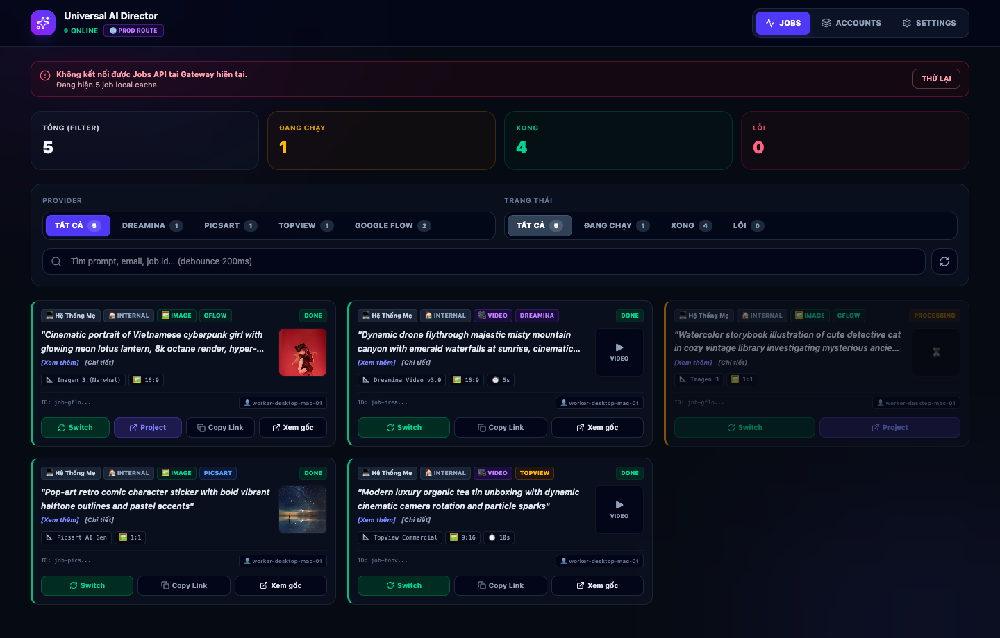
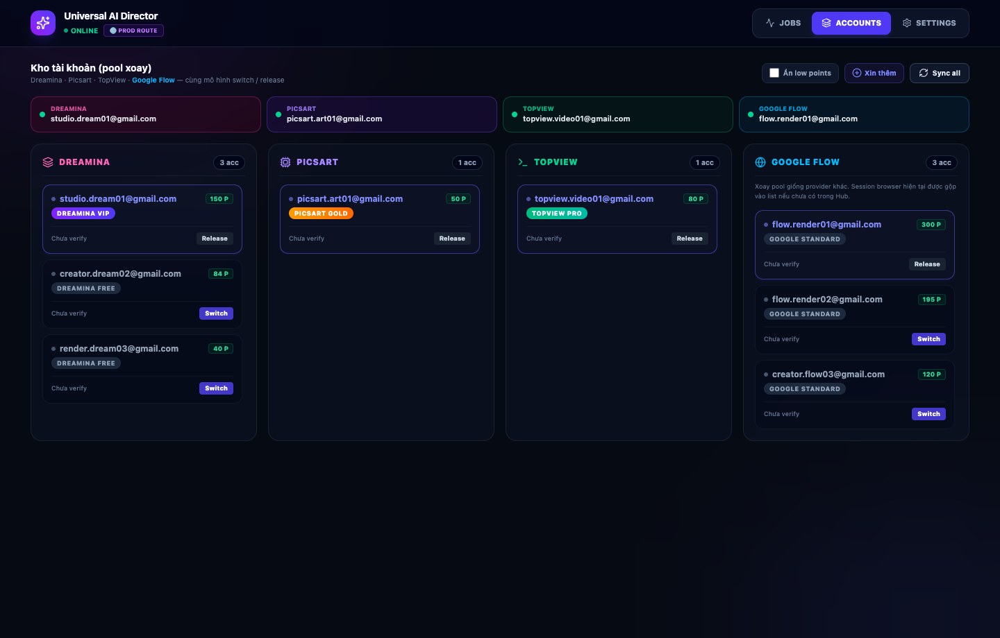
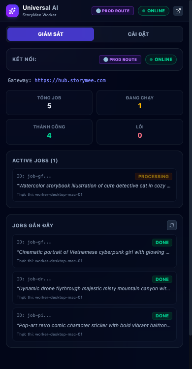
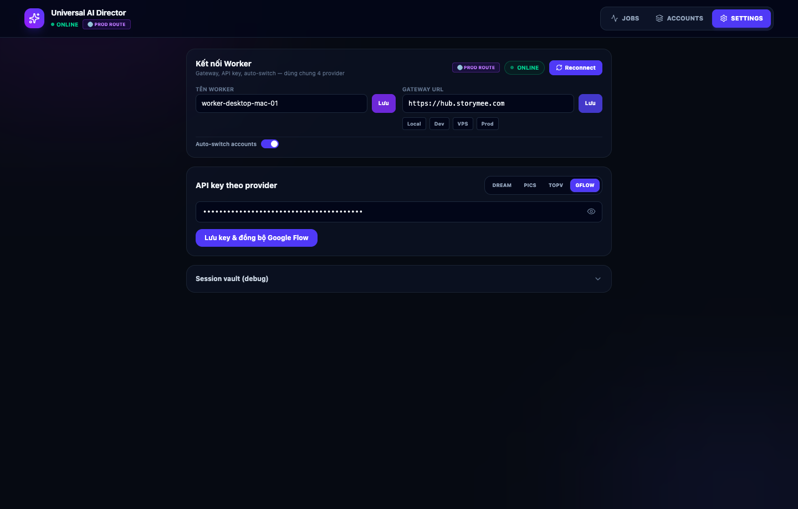

# StoryMee Universal AI Director (Chrome Extension)

> **Client Automation Edge Worker** — Nền tảng tự động hóa trình duyệt biến Chrome thành một nút tính toán biên (Edge Worker), kết nối trực tiếp vào hệ thống **StoryMee Ecosystem** để điều phối, sinh ảnh và video chất lượng cao từ các nhà cung cấp AI hàng đầu (**Google Labs Flow**, **ByteDance Dreamina**, **Picsart**, **TopView**).

| Thông tin | Giá trị |
|---|---|
| **Phiên bản** | `1.0.7` (`manifest.json` / `package.json`) |
| **Kiến trúc** | Chrome Extension Manifest V3 (MV3) + Offscreen Document |
| **Công nghệ** | React 19, TypeScript, Vite, Tailwind CSS v4, Zustand |
| **Đường dẫn repo** | `5-Extension-Automations/universal-ai-extension` |
| **Tài liệu hệ sinh thái** | [`extension-rotation.md`](../../00-Ecosystem-Docs/01-architecture/jobs/extension-rotation.md) · [`job-tracking`](../../00-Ecosystem-Docs/01-architecture/jobs/job-tracking/README.md) · [`06-extension-contract`](../../00-Ecosystem-Docs/01-architecture/jobs/job-tracking/06-extension-contract.md) |
| **Báo cáo kỹ thuật** | [BAO_CAO_KY_THUAT.md](./BAO_CAO_KY_THUAT.md) |
| **Lịch sử cập nhật** | [CHANGELOG.md](./CHANGELOG.md) |

---

## 1. Tại Sao Phải Sử Dụng Chrome Extension? (Core Rationale)

Tại sao StoryMee lại phát triển một Chrome Extension thay vì gọi API trực tiếp từ máy chủ Backend (Node.js/Python trên VPS hoặc Cloud Data Center)? Đây là quyết định kiến trúc mang tính chiến lược vì 4 lý do cốt lõi:

```
                                  TẠI SAO DÙNG EXTENSION?
                                             │
      ┌──────────────────────┬───────────────┴───────────────┬──────────────────────┐
      ▼                      ▼                               ▼                      ▼
1. Tận Dụng Free Quota  2. Bypass Anti-Bot & WAF    3. Distributed Workers   4. Auto-Rotation Pool
  • Daily credits web    • Real Chrome TLS/JA4       • Biến máy trạm thành     • Tự động checkout cookie
  • Không tốn phí API    • Cookie & Session thật       nút AI render           • Hết điểm đổi ngay nick khác
  • Tiết kiệm 100%       • Vượt CAPTCHA / SecSDK     • Giảm tải server         • Hoạt động liên tục 24/7
```

### 1.1 Tận dụng hạn mức miễn phí (100% Free Compute & Daily Quotas)
- **Thực trạng ngành AI:** Các nền tảng AI tạo ảnh/video hàng đầu hiện nay như **Google Labs Flow** (Imagen 3 / Veo), **ByteDance Dreamina**, **Picsart**, **TopView** luôn cung cấp hạn mức miễn phí hàng ngày (daily free credits / compute quotas) rất hào phóng trên giao diện Web người dùng để thu hút cộng đồng.
- **Rào cản API trả phí:** Các dịch vụ này hoặc **không cung cấp Public API thương mại** (như Google Flow hiện chỉ là experimental web tool), hoặc nếu có thì chi phí API chính thức cực kỳ đắt đỏ (từ **\$0.05 đến \$0.25+** cho mỗi ảnh/video độ phân giải cao).
- **Giải pháp:** Bằng cách kết nối một hệ thống quản lý tài khoản tập trung (Account Pool), Extension tự động tận dụng triệt để các hạn mức miễn phí này từ hàng chục, hàng trăm tài khoản, giúp hệ sinh thái StoryMee tạo ra hàng ngàn hình ảnh/video chất lượng studio mỗi ngày với **chi phí bằng 0**.

### 1.2 Vượt rào Anti-Bot, WAF & Bảo vệ Trình duyệt (Real Browser Fingerprint)
- **Giới hạn của Backend Server:** Nếu gửi request trực tiếp từ Backend (Node.js/Python trên máy chủ đám mây như AWS, DigitalOcean hay VPS), IP server sẽ bị nhận diện là Datacenter IP và bị các hệ thống WAF/Anti-bot hàng đầu (**Cloudflare Turnstile, Akamai Bot Manager, Google reCAPTCHA Enterprise, ByteDance SecSDK**) chặn đứng lập tức (HTTP 403, Cloudflare Challenge, mã hóa chữ ký payload).
- **Sức mạnh của Extension:** Extension chạy trực tiếp bên trong trình duyệt Google Chrome thật của máy trạm:
  - Sở hữu đầy đủ **TLS Fingerprint chuẩn Chrome (JA3/JA4)** và HTTP/2 parameters nguyên bản.
  - Mang phiên đăng nhập hợp lệ (Authentication Cookies, LocalStorage, IndexedDB).
  - Tự nhiên vượt qua các cơ chế kiểm tra bảo mật phía client (reCAPTCHA v3, Turnstile, DOM validation) mà không bị hệ thống phòng thủ đánh dấu là bot.

### 1.3 Mô hình Điện toán Phân tán (Distributed Edge Worker Network)
- **Tận dụng phần cứng sẵn có:** Biến bất kỳ máy tính văn phòng, laptop của đội ngũ hoặc máy ảo (VM) có cài Chrome thành một **AI Rendering Node** hoạt động độc lập.
- **Giảm tải cho Backend:** Server trung tâm (`storymee-hub` và các Fastify microservices) chỉ chịu tải nhẹ cho việc định tuyến và quản lý hàng đợi job (Job Queuing via NATS JetStream). Toàn bộ quá trình render nặng, tải ảnh, encode/decode base64 và gửi nhận request được chia tải phân tán cho các browser worker.

### 1.4 Tự động hóa xoay vòng tài khoản (Centralized Multi-Account Pool & Auto-Rotation)
- Khi một tài khoản hết credit trong ngày hoặc bị rate-limit, Extension phối hợp với `core-worker-pool-api` qua Hub để:
  1. Tự động trả (checkin) tài khoản cũ và ghi nhận số điểm đã tiêu hao.
  2. Lấy (checkout) tài khoản mới có sẵn credit trong hồ bơi tài khoản.
  3. Bơm (inject) cookie mới vào trình duyệt mà không cần người dùng phải đăng xuất hay đăng nhập thủ công.
  4. Đảm bảo luồng tạo nội dung của hệ sinh thái StoryMee diễn ra thông suốt 24/7.

---

## 2. Kiến Trúc Kết Nối Vào Hệ Sinh Thái StoryMee

Extension đóng vai trò là một Client Worker nhận lệnh từ **StoryMee Hub Gateway** thông qua kết nối WebSocket thời gian thực:

```
┌────────────────────────────────────────────────────────────────────────────────┐
│                         STORYMEE BACKEND ECOSYSTEM                             │
│                                                                                │
│  Client Apps (Mobile, Web) ──► Gateway Go (storymee-hub :5100)                │
│                                      │                                         │
│                                 NATS JetStream                                 │
│                                      │                                         │
│                                core-job-api                                    │
└──────────────────────────────────────┬─────────────────────────────────────────┘
                                       │ WebSocket (wss://hub.storymee.com/...)
                                       ▼
┌────────────────────────────────────────────────────────────────────────────────┐
│                  UNIVERSAL AI EXTENSION (CHROME MV3)                           │
│                                                                                │
│  ┌───────────────────────┐  proxy messages  ┌───────────────────────────────┐ │
│  │   Offscreen Document  │ ◄──────────────► │   Background Service Worker   │ │
│  │   • Giữ kết nối WS 24/7│                  │   • Điều phối Jobs            │ │
│  │   • Heartbeat / Ping  │                  │   • Quản lý Cookie & OAuth    │ │
│  │   • ACK / Status      │                  │   • Khóa Mutex tuần tự        │ │
│  └───────────────────────┘                  └───────────────┬───────────────┘ │
│                                                             │                 │
│                                                             ▼ Drivers         │
│  ┌─────────────────────────────────────────────────────────────────────────┐  │
│  │                            AI PROVIDER DRIVERS                          │  │
│  │  • GoogleLabsDriver: Gọi Flow Media API, bắt OAuth Bearer ya29, CAPTCHA │  │
│  │  • DreaminaDriver:   Điều phối tab Dreamina, cào điểm, tracking video   │  │
│  │  • PicsartDriver:    Tự động hóa tác vụ sinh ảnh Picsart                │  │
│  │  • TopViewDriver:    Sinh video AI qua luồng IAM TopView                │  │
│  └─────────────────────────────────────────────────────────────────────────┘  │
│                                       │                                        │
│                                       ▼ Chrome Tabs (Auto-generation)          │
│  ┌─────────────────────────────────────────────────────────────────────────┐  │
│  │   [labs.google/fx/tools/flow]    [dreamina.capcut.com]    [picsart.com] │  │
│  └─────────────────────────────────────────────────────────────────────────┘  │
└──────────────────────────────────────┬─────────────────────────────────────────┘
                                       │ Upload kết quả hoàn thành
                                       ▼
                 ┌──────────────────────────────────────────────┐
                 │ Cloudflare R2 / MinIO Storage (Media Output) │
                 └──────────────────────────────────────────────┘
```

### Chi tiết các tầng xử lý:
1. **Offscreen Document (`src/offscreen.ts`):** 
   - Giải quyết hạn chế chí mạng của Chrome Manifest V3: Service Worker tự động ngủ đông sau 30 giây rảnh rỗi.
   - Offscreen Document duy trì WebSocket liên tục 24/7 với Hub Gateway tại `/v1/media/gflow-extension/ws`.
   - Đóng vai trò cầu nối proxy gửi nhận message giữa WebSocket và Service Worker.
2. **Background Service Worker (`src/background.ts`):** 
   - Lắng nghe sự kiện `GENERATE_JOB` từ Offscreen.
   - Tự động nhận diện provider tương ứng, kiểm tra phiên đăng nhập/cookie, khóa Mutex chống xung đột luồng và điều hướng sang Driver cụ thể.
3. **Provider Drivers (`src/features/*`):** 
   - Trực tiếp gửi request hoặc tương tác với DOM/API nội bộ của các nhà cung cấp AI.
   - Thu thập kết quả ảnh/video sinh ra, upload lên hạ tầng lưu trữ của StoryMee và báo cáo `JOB_DONE` về Hub.

---

## 3. Các Đơn Vị Cung Cấp Hỗ Trợ (Supported Providers)

Extension hỗ trợ kiến trúc cắm rút (**Driver Pattern**) cho các nền tảng AI sinh ảnh/video hàng đầu:

| Nhà cung cấp | Loại media | Điểm mạnh kỹ thuật của Driver |
|---|---|---|
| **Google Labs Flow** (`GFLOW`) | Ảnh (Imagen 3 / Narwhal), Video | • Bắt token `Authorization: Bearer ya29.` tự động qua `chrome.webRequest`.<br>• Tự động giải reCAPTCHA v3 trên tab Google Labs.<br>• Gọi trực tiếp API nội bộ `batchGenerateImages` chuẩn payload (proven shape).<br>• Tự động tạo và điều hướng project làm việc riêng biệt. |
| **Dreamina (CapCut/ByteDance)** (`DREAMINA`) | Ảnh AI, Video AI | • Mutex job queue: tuần tự hóa tác vụ, chống xung đột cookie.<br>• Tự động cào điểm credit còn lại trong tài khoản.<br>• Cơ chế theo dõi tiến trình video thời gian thực qua WebSocket của Dreamina.<br>• Inject cookie session động từ Hub Worker-Pool. |
| **Picsart** (`PICSART`) | Ảnh chỉnh sửa, Text-to-Image | • Đồng bộ cookie phiên làm việc từ pool trung tâm.<br>• Tự động điền prompt và thu thập asset kết quả. |
| **TopView** (`TOPVIEW`) | Video AI Marketing | • Tự động hóa qua luồng định tuyến IAM Worker của StoryMee. |

---

## 4. Giao Diện Người Dùng & Hình Ảnh Thực Tế (Visual Showcase)

Extension cung cấp 2 chế độ hiển thị linh hoạt được xây dựng hoàn toàn bằng **React 19**, **Tailwind CSS v4** và **Zustand**:

### 4.1 Bảng Điều Khiển Toàn Diện (Full Dashboard — Jobs History & Monitor)
> Quản lý tập trung toàn bộ tiến trình render, lọc đa chiều theo Provider (Google Flow, Dreamina, Picsart, TopView) và trạng thái công việc (Pending, Processing, Done, Failed).



### 4.2 Kho Quản Trị & Xoay Vòng Tài Khoản (Multi-Account Pool)
> Hiển thị hạn mức credit / điểm thưởng thực tế của từng tài khoản, hỗ trợ cơ chế gán tài khoản tự động (Auto-switch) và giải phóng (Release) tức thời khi tài khoản hết hạn mức.



### 4.3 Giám Sát Cạnh Trình Duyệt (Chrome Side Panel) & Cấu Hình Kết Nối
| Chrome Side Panel (Thu nhỏ 390px) | Cấu Hình Kết Nối Gateway & API Keys |
|:---:|:---:|
|  |  |
| *Giám sát realtime trạng thái Online/Offline, Job đang chạy và kết quả mới nhất ngay khi đang duyệt web.* | *Thiết lập địa chỉ StoryMee Hub Gateway, Worker ID và phân quyền API Key cho từng provider.* |

---

## 5. Hướng Dẫn Cài Đặt & Vận Hành (Build & Setup)

### Yêu cầu tiên quyết
- **Node.js**: Phiên bản `20.x` trở lên (khuyên dùng Node 22 LTS).
- **Google Chrome**: Phiên bản 120 trở lên (hỗ trợ đầy đủ Manifest V3 và Offscreen API).

### 5.1 Cài đặt & Build mã nguồn

```bash
# Di chuyển vào thư mục extension
cd 5-Extension-Automations/universal-ai-extension

# Cài đặt các gói phụ thuộc
npm install

# Build mã nguồn sang thư mục dist/
npm run build
```

### 5.2 Nạp Extension vào Chrome

1. Mở trình duyệt Chrome và truy cập địa chỉ: `chrome://extensions/`
2. Bật công tắc **Developer mode** (Chế độ dành cho nhà phát triển) ở góc trên bên phải.
3. Nhấp vào nút **Load unpacked** (Tải tiện ích đã giải nén).
4. Tìm và chọn thư mục `dist/` bên trong `universal-ai-extension`.
5. Ghim (Pin) biểu tượng extension lên thanh công cụ Chrome.

### 5.3 Cấu hình kết nối Hub Gateway

1. Mở giao diện Cài đặt (Settings) của Extension (hoặc qua icon Sidepanel).
2. Điền các tham số kết nối:
   - **Gateway Hub URL:** `https://hub.storymee.com` (hoặc `http://localhost:5100` khi phát triển local).
   - **Hub API Key:** Nhập API Key do quản trị viên cấp (có quyền worker).
   - **Worker Name:** Đặt tên định danh cho máy trạm (ví dụ: `worker-laptop-01`).
3. Nhấn **Save & Connect**. Trạng thái trên đầu giao diện sẽ chuyển sang **🟢 ONLINE**, sẵn sàng nhận job từ hệ thống lớn.

---

## 6. Cấu Trúc Thư Mục Dự Án (Source Code Anatomy)

```
universal-ai-extension/
├── src/
│   ├── offscreen.ts              # Duy trì kết nối WebSocket ổn định với Hub Gateway
│   ├── background.ts             # Service Worker: Router điều phối job, cookie, auth
│   ├── App.tsx                   # Ứng dụng chính (Giao diện React)
│   ├── components/               # Các UI components (JobCard, Header, ProviderTabs...)
│   ├── core/
│   │   ├── api.ts                # Client gọi REST API của Hub Gateway
│   │   ├── hubClient.ts          # Logic kết nối và đồng bộ WebSocket
│   │   └── AIDriver.ts           # Interface chuẩn hóa cho các AI Driver
│   ├── features/
│   │   ├── google-flow/          # Driver, API, và DOM helpers cho Google Labs Flow
│   │   └── dreamina/             # Driver, API, và cookie sync cho Dreamina
│   ├── store/
│   │   └── extensionStore.ts     # Quản lý state toàn cục với Zustand
│   └── utils/
│       ├── cookies.ts            # Quản lý và inject cookie trình duyệt
│       └── crypto.ts             # Hỗ trợ mã hóa, tính CRC32, AWS v4 signature
├── dist/                         # Bundle đầu ra sẵn sàng để nạp vào Chrome
├── manifest.json                 # Cấu hình Chrome Manifest V3
├── vite.config.ts                # Cấu hình đóng gói Vite + CRXJS plugin
└── BAO_CAO_KY_THUAT.md           # Báo cáo kỹ thuật chi tiết về giao thức mạng và payload
```

---

## 7. Nguyên Tắc & Quy Chuẩn Kỹ Thuật (Guardrails)

1. **Luôn đi qua Gateway Hub (Port 5100):** Tuyệt đối không gọi trực tiếp các cổng microservice nội bộ (4502, 4506...). Mọi luồng giao tiếp phải qua Gateway (`/worker/v1/...`).
2. **Khóa Mutex chống xung đột Tab:** Khi một driver đang thao tác trên tab (ví dụ: Google Flow đang render hoặc Dreamina đang inject cookie), hệ thống kích hoạt cơ chế khóa tuần tự nhằm tránh xung đột phiên làm việc và tránh bị phát hiện spam request.
3. **An toàn bảo mật:** Tuyệt đối không in (log) token OAuth Bearer hoặc private cookie ra màn hình console công khai.
4. **Chuẩn hóa Image Payload của GFlow:** Tuân thủ nghiêm ngặt định dạng payload `IMAGE_INPUT_TYPE_REFERENCE` đã được kiểm chứng tại [BAO_CAO_KY_THUAT.md](./BAO_CAO_KY_THUAT.md). Không tự ý thêm các trường thử nghiệm làm phát sinh lỗi `400 INVALID_ARGUMENT`.

---

© 2026 StoryMee Ecosystem. All rights reserved.
